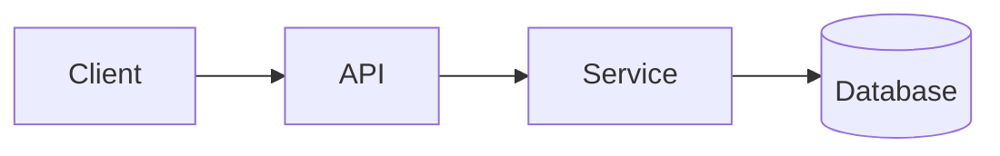

# SKILL.md — Universal Repository README Generator

A reusable specification that any repo can drop in to produce a **production-grade, industry-standard README**. Save the content below as `SKILL.md` (or `.github/SKILL.md`) in your repo. It defines:

1. The **principles** a great README must follow
2. The **canonical section structure** (with what each section must contain)
3. **Templates and snippets** ready to copy
4. A **checklist** to validate the result
5. Optional **automation hooks** for CI/AI assistants

---

````markdown
# SKILL: Repository README Generation

> **Purpose**: A canonical, opinionated specification for producing a high-quality `README.md`
> for **any** repository — library, service, CLI, plugin, model, dataset, or monorepo.
> Use this file as a contract for humans **and** AI coding assistants.

---

## 1. Guiding principles

A README must answer five questions in the first 60 seconds:

1. **What** is this project? (one sentence)
2. **Why** does it exist? (the problem it solves)
3. **Who** is it for? (target audience)
4. **How** do I use it? (install + minimal example)
5. **Where** do I go next? (docs, contributing, license)

Quality bar:

- **Skimmable**: clear hierarchy, short paragraphs, tables and code blocks over prose.
- **Self-contained**: a newcomer can install, run, and contribute without leaving the README.
- **Truthful**: every command, badge, link, and version must work at the time of commit.
- **Accessible**: alt text on images, descriptive link text, no jargon without definition.
- **Versioned**: kept in sync with code; PRs that change behavior must update the README.
- **Localizable**: keep README.md in English; translations as `README.<lang>.md`.

---

## 2. Canonical section structure

Sections marked **REQUIRED** must appear in every repo. Others are conditional.

| # | Section | Status | When to include |
|---|---|---|---|
| 1 | Project header (name, tagline, badges, hero image) | REQUIRED | Always |
| 2 | Table of contents | RECOMMENDED | README > 200 lines |
| 3 | Overview / What & Why | REQUIRED | Always |
| 4 | Key features | REQUIRED | Always |
| 5 | Demo / Screenshots / Diagrams | RECOMMENDED | UI, CLI, or architecture worth showing |
| 6 | Architecture | RECOMMENDED | Multi-component or non-trivial systems |
| 7 | Quick start | REQUIRED | Always |
| 8 | Installation | REQUIRED | Always |
| 9 | Usage / Examples | REQUIRED | Always |
| 10 | Configuration | CONDITIONAL | If config exists |
| 11 | API reference / CLI reference | CONDITIONAL | If applicable |
| 12 | Project structure | RECOMMENDED | Repos with > ~10 top-level entries |
| 13 | Development & contributing | REQUIRED | Always |
| 14 | Testing | REQUIRED | Always |
| 15 | Deployment / Release | CONDITIONAL | Services, packages, plugins |
| 16 | Performance & benchmarks | OPTIONAL | Performance-sensitive projects |
| 17 | Security | REQUIRED | Always (link to `SECURITY.md`) |
| 18 | Roadmap | RECOMMENDED | Active projects |
| 19 | FAQ / Troubleshooting | RECOMMENDED | Public projects |
| 20 | Changelog | REQUIRED | Link to `CHANGELOG.md` |
| 21 | Contributors / Acknowledgements | RECOMMENDED | Always |
| 22 | License | REQUIRED | Always |
| 23 | Contact / Support | REQUIRED | Always |

---

## 3. Section-by-section specification

### 3.1 Project header
- **H1 = exact project name** (no emoji prefix in H1; use one in the tagline if you must).
- **One-sentence tagline** under the title.
- **Badges row** (≤ 6, in this order): build status, coverage, package version, downloads, license, language version.
- Optional **hero image / logo** centered, max width 320px.

```markdown
<h1 align="center">project-name</h1>
<p align="center"><em>One-sentence value proposition.</em></p>

<p align="center">
  <a href="…"></a>
  <a href="…"></a>
  <a href="…"></a>
  
</p>
```

### 3.2 Table of contents
Auto-generate with a tool (e.g., `markdown-toc`) when README exceeds 200 lines.

### 3.3 Overview / What & Why
- 2–4 short paragraphs.
- Explicitly state the **problem**, the **solution**, and **non-goals**.
- Avoid marketing fluff; lead with concrete capability.

### 3.4 Key features
- 4–8 bullets, each ≤ 12 words, action-oriented (verb-first).
- Group by theme if more than 8.

### 3.5 Demo / Screenshots / Diagrams
- Animated GIF or short MP4 for UI/CLI projects (≤ 5 MB).
- Mermaid/PlantUML/D2 diagrams over static images when possible (renderable in GitHub).

### 3.6 Architecture
- Use a **C4 container** or **component** diagram for systems.
- Caption with one sentence describing what the diagram shows.
- Keep diagrams in `/docs/diagrams` and embed as code or rendered SVG.

```markdown
*High-level architecture — request flow from client to data store*


```

### 3.7 Quick start
- A **single, copy-pasteable** block that takes a user from zero to a working result in ≤ 60 seconds.
- Show expected output.

```bash
# Install
pipx install project-name

# Run
project-name --help
```

### 3.8 Installation
- Cover **all** supported install paths: package manager, source, Docker, binary.
- State **prerequisites** (OS, language version, system libs) explicitly.
- Provide a verification command (e.g., `project-name --version`).

| Method | Command |
|---|---|
| pip | `pip install project-name` |
| Docker | `docker run ghcr.io/org/project-name:latest` |
| Source | `git clone … && make install` |

### 3.9 Usage / Examples
- Start with the **simplest meaningful example**, then progress to advanced.
- Each example: minimal, runnable, with expected output.
- For libraries, show **import + call + result**.
- For services, show **request + response**.
- For CLIs, show **command + stdout**.

### 3.10 Configuration
- Document **every** environment variable, flag, and config file key in a table.
- Include **type**, **default**, **required?**, and **description**.

| Key | Type | Default | Required | Description |
|---|---|---|---|---|
| `LOG_LEVEL` | string | `info` | no | Logging verbosity |
| `API_KEY` | string | — | yes | Authentication token |

### 3.11 API / CLI reference
- For libraries: link to generated docs (Sphinx, TypeDoc, Rustdoc, godoc).
- For CLIs: include `--help` output or a generated reference.
- For HTTP APIs: link to OpenAPI/Swagger; include 1–2 representative endpoints inline.

### 3.12 Project structure
- Show top-level layout with one-line annotations.
- Skip generated/boilerplate folders.

```text
.
├── src/                # Library source
├── tests/              # Unit + integration tests
├── docs/               # User-facing documentation
├── examples/           # Runnable examples
├── scripts/            # Dev and CI helpers
└── pyproject.toml      # Build config
```

### 3.13 Development & contributing
- **Local setup** in ≤ 5 commands.
- **Coding standards** (link to `CONTRIBUTING.md`, `STYLEGUIDE.md`).
- **Branching model** (trunk-based, GitFlow, etc.).
- **Commit conventions** (e.g., Conventional Commits).
- **PR checklist** link.

### 3.14 Testing
- One command to run all tests.
- Separate commands for unit / integration / e2e if applicable.
- Coverage target stated explicitly.
- How to add a new test.

### 3.15 Deployment / Release
- Versioning scheme (SemVer).
- Release process (tag → CI → registry).
- Rollback procedure for services.

### 3.16 Performance & benchmarks
- Reproducible commands.
- Hardware/environment used.
- Comparison table vs. alternatives if relevant.

### 3.17 Security
- Link to `SECURITY.md` (vulnerability reporting policy).
- Supported versions table.
- Known limitations / threat model summary.

### 3.18 Roadmap
- Link to issues, project board, or milestones.
- 3–5 near-term items inline.

### 3.19 FAQ / Troubleshooting
- 5–10 real questions from issues/support.
- Format: question as H3, concise answer.

### 3.20 Changelog
- Link to `CHANGELOG.md` (keep-a-changelog format).
- Latest version highlights inline.

### 3.21 Contributors / Acknowledgements
- Use [all-contributors](https://allcontributors.org/) or `CONTRIBUTORS.md`.
- Credit upstream projects, sponsors, inspirations.

### 3.22 License
- SPDX identifier + link to `LICENSE` file.
- One line: `Released under the [MIT License](LICENSE).`

### 3.23 Contact / Support
- Issue tracker for bugs / features.
- Discussion forum / Slack / Discord for questions.
- Security contact (email or form) — never use public issues.

---

## 4. Cross-cutting requirements

### 4.1 Companion files (must exist alongside README)
- `LICENSE`
- `CONTRIBUTING.md`
- `CODE_OF_CONDUCT.md` (Contributor Covenant)
- `SECURITY.md`
- `CHANGELOG.md`
- `.github/ISSUE_TEMPLATE/`, `.github/PULL_REQUEST_TEMPLATE.md`
- `CITATION.cff` for academic / research projects

### 4.2 Style rules
- **Headings**: sentence case; one H1 only; no skipped levels.
- **Line length**: soft-wrap at ~100 chars for diff-friendliness.
- **Code blocks**: always specify language for syntax highlighting.
- **Links**: descriptive text (no "click here"); prefer relative links inside the repo.
- **Images**: store under `/docs/assets` or `/.github/assets`; always include `alt`.
- **Emoji**: use sparingly; never as the only signifier of meaning.
- **Tone**: second person, active voice, present tense.

### 4.3 Accessibility
- Alt text on every image and diagram.
- Sufficient color contrast in custom badges.
- Don't rely on color alone to convey status.

### 4.4 Localization
- Primary README in English at repo root.
- Translations: `README.fr.md`, `README.ja.md`, etc., linked from a language switcher at the top.

---

## 5. Validation checklist

Use this before merging any README change.

- [ ] H1 matches package/repo name exactly
- [ ] Tagline ≤ 120 characters
- [ ] All required sections present
- [ ] Quick start works on a clean machine
- [ ] All commands tested (copy-paste-run)