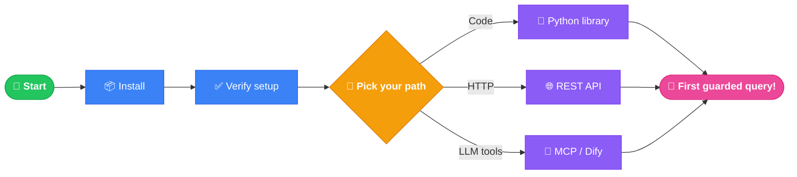

<h1 align="center">🛡️ Welcome to sql-data-guard</h1>
<p align="center"><em>From zero to your first guarded SQL query — in under 5 minutes.</em></p>

<p align="center">
  
  
  
  
</p>

> [!NOTE]
> **New here?** This is your map. Follow it top-to-bottom and you'll have the project installed, a query verified, and the tests passing — before your coffee gets cold. ☕

---

## 🗺️ Your onboarding journey



---

## 1️⃣ What is this, in one breath?

> [!TIP]
> **sql-data-guard checks an SQL query against an allow-list policy *before* it hits your database — and rewrites it if it breaks the rules.** Perfect for taming SQL that LLMs generate. 🤖→🛡️→🗄️

---

## 2️⃣ Prerequisites

Tick these off before you start:

- [ ] 🐍 **Python ≥ 3.8** installed → check with `python --version`
- [ ] 📥 **pip** available → check with `pip --version`
- [ ] 🌿 **git** (only if installing from source)
- [ ] 🐳 **Docker** *(optional — only for the REST API container)*

> [!NOTE]
> The only runtime dependency is [`sqlglot`](https://github.com/tobymao/sqlglot). No database, no heavy stack. 🪶

---

## 3️⃣ Install & verify (the 60-second setup)

```bash
# Install from PyPI
pip install sql-data-guard

# Verify it imported correctly
python -c "from sql_data_guard import verify_sql; print('✅ sql-data-guard is ready!')"
```

<details>
<summary>🛠️ Prefer installing from source? (for contributors)</summary>

```bash
git clone https://github.com/ThalesGroup/sql-data-guard.git
cd sql-data-guard
pip install -e .
pip install -r test/test.requirements.txt
```

</details>

---

## 4️⃣ Your first win 🎉

Paste this into a file (`hello_guard.py`) and run it:

```python
from sql_data_guard import verify_sql

# 🎯 The policy: only these columns, only this account's rows
config = {
    "tables": [
        {
            "table_name": "orders",
            "columns": ["id", "product_name", "account_id"],
            "restrictions": [{"column": "account_id", "value": 123}],
        }
    ]
}

# 🚨 A sketchy LLM-generated query (restricted column + always-true injection)
query = "SELECT id, name FROM orders WHERE 1 = 1"

result = verify_sql(query, config)
print(result)
```

You'll see the guard **catch the problems and hand you a safe rewrite**:

```json
{
  "allowed": false,
  "errors": [
    "Column name not allowed. Column removed from SELECT clause",
    "Always-True expression is not allowed",
    "Missing restriction for table: orders column: account_id value: 123"
  ],
  "fixed": "SELECT id, product_name, account_id FROM orders WHERE account_id = 123",
  "risk": 0.7
}
```

> [!IMPORTANT]
> 🧠 **The mental model:** you give it `sql` + `config`, it gives you back `allowed`, `errors`, a `fixed` query, and a `risk` score (0 = safe → 1 = dangerous). That's the whole API.

---

## 5️⃣ Pick your path 🎯

Choose the integration that matches how *you* build:

| Path | You want to… | Go here |
|---|---|---|
| 🐍 **Python library** | Embed checks directly in app code | [`src/sql_data_guard/`](src/sql_data_guard/) · [README](README.md#usage-and-examples) |
| 🌐 **REST API** | Call it from any language / container | [`src/sql_data_guard/rest/`](src/sql_data_guard/rest/) · see below |
| 🔌 **MCP wrapper** | Guard an MCP database server | [`examples/mcp-wrapper-sqlite/`](examples/mcp-wrapper-sqlite/) |
| 🧩 **Dify plugin** | Add it to a Dify LLM workflow | [`plugins/dify/`](plugins/dify/README.md) |

<details>
<summary>🌐 Spin up the REST API + Swagger UI</summary>

```bash
pip install flask flasgger sql-data-guard
APP_PORT=5050 PYTHONPATH=src python src/sql_data_guard/rest/sql_data_guard_rest.py
```

Then open the interactive playground 👉 **http://localhost:5050/apidocs**

Or run it as a container:

```bash
docker run -d -p 5000:5000 ghcr.io/thalesgroup/sql-data-guard
```

</details>

---

## 6️⃣ Run the tests ✅

Confirm everything works on your machine:

```bash
PYTHONPATH=src python -m pytest --color=yes test/*_unit.py
```

<details>
<summary>🪟 On Windows (cmd)?</summary>

```bat
set PYTHONPATH=src
python -m pytest --color=yes test\*_unit.py
```

</details>

Green output means you're fully set up. 🟢

---

## 7️⃣ Where things live 🧭

```text
sql-data-guard/
├── 🧠 src/sql_data_guard/      → the core engine (verify_sql lives here)
│   ├── rest/                   → 🌐 Flask REST API + Swagger
│   └── mcpwrapper/             → 🔌 MCP server guard
├── 🧩 plugins/dify/            → Dify LLM-workflow plugin
├── 📚 docs/manual.md           → restriction rules & operations reference
├── 🧪 test/                    → the test suite
└── 📖 README.md                → the full project docs
```

> [!TIP]
> Want the deep dive on restriction rules (`BETWEEN`, `IN`, comparisons)? → [`docs/manual.md`](docs/manual.md)

---

## 8️⃣ Common gotchas 🩹

> [!WARNING]
> **Local REST calls return `503` / a Squid error page?**
> A corporate proxy is intercepting localhost. Bypass it: add `localhost, 127.0.0.1` to your proxy exceptions, or use `curl --noproxy "*"`.

> [!WARNING]
> **`ModuleNotFoundError` when running from source?**
> You forgot `PYTHONPATH=src`. Prefix your command with it (or `set PYTHONPATH=src` on Windows).

> [!WARNING]
> **Need a non-default port for the REST API?**
> Set the `APP_PORT` environment variable (defaults to `5000`).

---

## 9️⃣ You're onboarded! What's next? 🚀

| I want to… | Go to |
|---|---|
| 📖 Read the full feature set | [README.md](README.md) |
| 📚 Understand every restriction rule | [docs/manual.md](docs/manual.md) |
| 🤝 Contribute code | [CONTRIBUTING.md](CONTRIBUTING.md) |
| 🔒 Report a security issue | [SECURITY.md](SECURITY.md) · security@opensource.thalesgroup.com |
| 🐛 File a bug or idea | [GitHub Issues](https://github.com/ThalesGroup/sql-data-guard/issues) |

---

<p align="center">
  <strong>Welcome aboard — go guard some queries! 🛡️</strong><br>
  <sub>Stuck for more than 15 minutes? Open an issue. A good question makes the docs better for the next person. 💚</sub>
</p>
