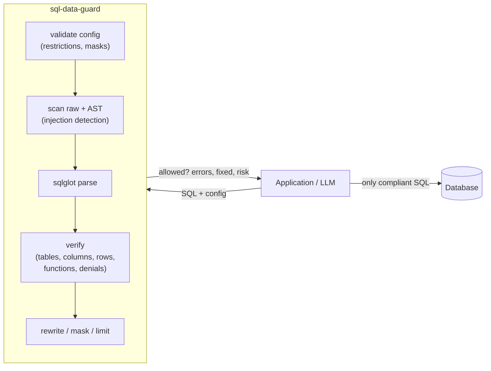

<h1 align="center">sql-data-guard</h1>
<p align="center"><em>A safety layer that verifies and rewrites SQL queries before they touch your database — built for the LLM era.</em></p>

<p align="center">
  
</p>

<p align="center">
  <a href="https://pypi.org/project/sql-data-guard/"></a>
  <a href="https://pypi.org/project/sql-data-guard/"></a>
  <a href="https://github.com/ThalesGroup/sql-data-guard/pkgs/container/sql-data-guard"></a>
  <a href="LICENSE.md"></a>
</p>

---

## Table of contents

- [Overview](#overview)
- [Key features](#key-features)
- [How it works](#how-it-works)
- [Architecture](#architecture)
- [Quick start](#quick-start)
- [Installation](#installation)
- [Usage and examples](#usage-and-examples)
- [Configuration](#configuration)
- [Policy and security controls](#policy-and-security-controls)
- [REST API reference](#rest-api-reference)
- [MCP wrapper](#mcp-wrapper)
- [Dify plugin](#dify-plugin)
- [Project structure](#project-structure)
- [Development and contributing](#development-and-contributing)
- [AI-assisted development](#ai-assisted-development)
- [Testing](#testing)
- [Deployment and release](#deployment-and-release)
- [Security](#security)
- [FAQ and troubleshooting](#faq-and-troubleshooting)
- [License](#license)
- [Contact and support](#contact-and-support)

---

## Overview

**What.** `sql-data-guard` is an open-source Python library and service that inspects an SQL query against a declarative restriction configuration, decides whether the query is allowed to run, and — when it is not — rewrites it into a compliant form.

**Why.** SQL is easy to use and just as easy to exploit. SQL injection remains one of the most targeted vulnerabilities, and the problem is amplified by *natural-language-to-SQL* features built on Large Language Models (LLMs). Prepared statements secure a query's *structure*, but LLM-generated queries are dynamic and have no fixed form, so they cannot be parameterized — leaving the door open to accidental data exposure and injection. `sql-data-guard` closes that gap by validating the query's *content* before execution.

**Who it is for.** Teams whose applications build SQL dynamically — especially with LLMs — and who need fine-grained, column-level and row-level access control that the database permission model cannot express. Typical cases:

- Applications that generate complex SQL queries.
- Applications that use LLMs to author SQL, where full query control is impractical.
- Per-user / per-role data access that must be correlated with fine-grained permissions.
- Multi-tenant apps needing row-level isolation that database permissions can't enforce.

**Non-goals.** `sql-data-guard` does **not** replace the database permission model. It is an *additional* layer for the restrictions that are complex, vendor-specific, or otherwise impossible to express at the database level.

---

## Key features

**Access and query control**
- **Verify** any SQL query against an allow-list of tables, columns, and restrictions.
- **Rewrite** non-compliant queries automatically into a safe, allowed form.
- **Enforce row-level security** by injecting missing restrictions (e.g. `account_id = 123`).
- **Deny columns** explicitly (`denied_columns`) even when otherwise allowed, and expand `SELECT *` to the allow-list.
- **Cap result rows** with `force_limit` — inject or clamp the outermost `LIMIT`.

**Data protection**
- **Mask sensitive columns** (`redact`, `hash`, `partial`) instead of dropping them, preserving the result shape for downstream apps.

**Threat detection**
- **Detect injection** — stacked statements, dangerous functions, system-catalog probing, and always-true (`1 = 1`) expressions; opt-in comment-evasion scanning.
- **Allow/Block SQL functions** by policy (`allowed_functions` / `blocked_functions`).
- **Block** disallowed statements (`INSERT`, `UPDATE`, `DELETE`, `CREATE`, DDL/commands).
- **Score risk** for every query (`0.0` → `1.0`) and **hard-block** above an optional `max_risk` threshold.

**Integration**
- **Integrate anywhere** — Python API, REST service with Swagger UI, MCP wrapper, or Dify plugin.
- **Multi-dialect** parsing via [sqlglot](https://github.com/tobymao/sqlglot) (SQLite, PostgreSQL, and more).

---

## How it works

1. **Input** — a SQL query string plus a restriction configuration (allowed tables, columns, restrictions, and optional policy controls).
2. **Validation** — the configuration itself is validated (supported operations, well-formed restrictions and column masks).
3. **Threat scan** — the raw string and parsed AST are scanned for injection patterns (stacked statements, dangerous functions, system-catalog probing, opt-in comment evasion).
4. **Verification** — the query is checked against the configuration: disallowed statements, unknown tables/columns, denied columns, `SELECT *`, static/always-true expressions, function policy, and missing row restrictions.
5. **Modification** — where possible, the query is rewritten to comply: remove denied/disallowed columns, expand `*`, mask sensitive columns, drop injection expressions, append required restrictions, and enforce the row cap.
6. **Output** — a result object with `allowed`, `errors`, `fixed`, and `risk`.

---

## Architecture

*High-level flow — a query and a policy go in; an allow/deny decision and an optional rewritten query come out.*



Integration surfaces, all sharing the same core `verify_sql`:

| Surface | Module / location | Use when |
|---|---|---|
| Python library | [src/sql_data_guard/](src/sql_data_guard/) | Embedding directly in app code |
| REST API (Flask + Swagger) | [src/sql_data_guard/rest/](src/sql_data_guard/rest/) | Language-agnostic / containerized use |
| MCP wrapper | [src/sql_data_guard/mcpwrapper/](src/sql_data_guard/mcpwrapper/) | Guarding an MCP database server |
| Dify plugin | [plugins/dify/](plugins/dify/) | Dify LLM workflows |

---

## Quick start

```bash
# Install
pip install sql-data-guard
```

```python
from sql_data_guard import verify_sql

config = {"tables": [{"table_name": "orders", "columns": ["id"],
                      "restrictions": [{"column": "account_id", "value": 123}]}]}

print(verify_sql("SELECT id FROM orders WHERE account_id = 123", config))
# {'allowed': True, 'errors': [], 'fixed': None, 'risk': 0.0}
```

---

## Installation

**Prerequisites:** Python ≥ 3.8. The only runtime dependency is [`sqlglot`](https://github.com/tobymao/sqlglot).

| Method | Command |
|---|---|
| pip | `pip install sql-data-guard` |
| Docker (REST API) | `docker run -d -p 5000:5000 ghcr.io/thalesgroup/sql-data-guard` |
| From source | `git clone https://github.com/ThalesGroup/sql-data-guard.git && cd sql-data-guard && pip install -e .` |

Verify the library import:

```bash
python -c "from sql_data_guard import verify_sql; print('ok')"
```

---

## Usage and examples

### Library

The example below shows `sql-data-guard` finding a restricted column and an always-true injection, removing both, and injecting a missing row restriction:

```python
from sql_data_guard import verify_sql

config = {
    "tables": [
        {
            "table_name": "orders",
            "columns": ["id", "product_name", "account_id"],
            "restrictions": [{"column": "account_id", "value": 123}],
        }
    ]
}

query = "SELECT id, name FROM orders WHERE 1 = 1"
result = verify_sql(query, config)
print(result)
```

Output:

```json
{
  "allowed": false,
  "errors": [
    "Column name not allowed. Column removed from SELECT clause",
    "Always-True expression is not allowed",
    "Missing restriction for table: orders column: account_id value: 123"
  ],
  "fixed": "SELECT id, product_name, account_id FROM orders WHERE account_id = 123",
  "risk": 0.7
}
```

`verify_sql(sql, config, dialect=None)` returns a dict with:

| Field | Type | Description |
|---|---|---|
| `allowed` | bool | Whether the query passes all restrictions as-is. |
| `errors` | list[str] | Human-readable violations found. |
| `fixed` | str \| null | A rewritten compliant query, or `null` if no fix was needed/possible. |
| `risk` | float | Risk score, `0.0` (safe) → `1.0` (high risk). |

### More examples

| SQL query | Result (summary) |
|---|---|
| `SELECT id, product_name FROM orders WHERE account_id = 123` | `allowed: true`, no fix needed |
| `SELECT id FROM orders WHERE account_id = 456` | `allowed: false` — appends `AND account_id = 123` |
| `SELECT id, col FROM orders WHERE account_id = 123` | `allowed: false` — removes disallowed `col` |
| `SELECT id FROM orders WHERE account_id = 123 OR 1 = 1` | `allowed: false` — strips always-true expression |
| `SELECT * FROM orders WHERE account_id = 123` | `allowed: false` — expands `*` to allowed columns |

See the [restriction manual](docs/manual.md) for the full set of rules and validation behavior.

---

## Configuration

The configuration is a dict with a top-level `tables` list. Each table declares its allowed `columns` and optional `restrictions`. A top-level `max_length` (default `10000`) caps the accepted SQL string length.

```json
{
  "max_length": 10000,
  "tables": [
    {
      "table_name": "orders",
      "columns": ["id", "product_name", "account_id"],
      "restrictions": [
        { "column": "account_id", "value": 123 },
        { "column": "price", "operation": "BETWEEN", "values": [100, 200] }
      ]
    }
  ]
}
```

### Restriction operations

| Operation | Field | Meaning |
|---|---|---|
| `=` (default) | `value` | Column must equal the value |
| `>` `<` `>=` `<=` | `value` | Numeric comparison against a single value |
| `BETWEEN` | `values` (two numbers, low < high) | Column within an inclusive range |
| `IN` | `values` (list, consistent type) | Column matches one of the listed values |

Validation errors are raised for unsupported operations (`UnsupportedRestrictionError`), missing `table_name`/`columns`, and invalid value types. Full details in [docs/manual.md](docs/manual.md).

---

## Policy and security controls

Beyond table/column allow-listing, `sql-data-guard` offers a set of **optional, declarative policy controls**. Everything except `tables` is optional, so existing configurations keep working unchanged.

### Top-level keys

| Key | Type | Default | Effect |
|---|---|---|---|
| `tables` | list | — (required) | Allowed tables and their `columns`, `restrictions`, etc. |
| `max_length` | int | `10000` | Reject SQL longer than this many characters. |
| `force_limit` | int | — | Inject or clamp the outermost `LIMIT` to this row cap. |
| `allowed_functions` | list[str] | — | If set, **only** these functions may be called (case-insensitive). |
| `blocked_functions` | list[str] | — | These functions are always blocked (case-insensitive). |
| `detect_comments` | bool | `false` | Opt-in: flag comment-based evasion (`--`, `/* */`, `#`). Also via `detect_injection.comments`. |
| `max_risk` | float | — | Hard-block (no auto-fix) when a query's risk exceeds this threshold. |

### Per-table keys

| Key | Type | Effect |
|---|---|---|
| `columns` | list[str] | Allow-list of selectable columns. |
| `restrictions` | list | Row filters (see operations above). |
| `denied_columns` | list[str] | Columns excluded from results even if present in `columns`. |
| `column_masks` | list | Column-masking rules (below). |

### Column masking (`column_masks`)

Masking rewrites a sensitive column into a masking expression instead of removing it — the query keeps returning a column with the same output name.

| Policy | Behavior | Options |
|---|---|---|
| `redact` | Replace the value with a constant | `replacement` (default `****`) |
| `hash` | Replace with a one-way `MD5(col)` | — |
| `partial` | Keep the last N characters, mask the rest | `show_last` (default `4`) |

### Always-on threat detection

No configuration is required for these — they have no legitimate use in an application query:

- **Stacked-statement rejection** (`a; b`).
- **Dangerous-function deny-list** — e.g. `xp_cmdshell`, `load_file`, `pg_read_file`, `pg_sleep`, `benchmark`, `waitfor`, `sys_exec`.
- **System-catalog probing** — e.g. `information_schema`, `sqlite_master`, `pg_catalog`.

### Example combining several controls

```json
{
  "force_limit": 1000,
  "blocked_functions": ["pg_sleep", "load_file"],
  "max_risk": 0.8,
  "tables": [
    {
      "table_name": "users",
      "columns": ["id", "email", "ssn", "tenant_id"],
      "denied_columns": ["ssn"],
      "column_masks": [
        { "column": "email", "policy": "hash" }
      ],
      "restrictions": [{ "column": "tenant_id", "value": 42 }]
    }
  ]
}
```

---

## REST API reference

A Flask service exposes `verify_sql` over HTTP, with an interactive Swagger UI powered by [flasgger](https://github.com/flasgger/flasgger).

### Run with Docker

```bash
docker run -d --name sql-data-guard -p 5000:5000 ghcr.io/thalesgroup/sql-data-guard
```

### Run from source

```bash
pip install flask flasgger sql-data-guard
# APP_PORT defaults to 5000
APP_PORT=5050 PYTHONPATH=src python src/sql_data_guard/rest/sql_data_guard_rest.py
```

On Windows (cmd):

```bat
set APP_PORT=5050
set PYTHONPATH=src
python src\sql_data_guard\rest\sql_data_guard_rest.py
```

### `POST /verify-sql`

Request body (`application/json`):

| Field | Type | Required | Description |
|---|---|---|---|
| `sql` | string | yes | The SQL query to verify. |
| `config` | object | yes | The restriction configuration. |
| `dialect` | string | no | SQL dialect (e.g. `sqlite`, `postgres`). |

```bash
curl -X POST http://localhost:5000/verify-sql \
     -H "Content-Type: application/json" \
     -d '{
           "sql": "SELECT * FROM orders WHERE account_id = 123",
           "config": {
             "tables": [
               { "table_name": "orders",
                 "columns": ["id", "product_name", "account_id"],
                 "restrictions": [{"column": "account_id", "value": 123}] }
             ]
           }
         }'
```

The response mirrors the library result (`allowed`, `errors`, `fixed`, `risk`).

### Swagger UI

With the server running, open `http://localhost:5050/apidocs`, expand **POST /verify-sql**, click **Try it out**, edit the pre-filled example, and **Execute**.

---

## MCP wrapper

The MCP wrapper transparently sits in front of an MCP database server: it intercepts `tools/call` requests, runs the SQL argument through `verify_sql`, and either rewrites the query or blocks it before it reaches the inner server. Configuration ([example](examples/mcp-wrapper-sqlite/config.json)) declares the inner `mcp-server` image, which `mcp-tools` carry SQL, and the `sql-data-guard` policy (including `dialect` and `inject-response`).

Runnable examples live in [examples/mcp-wrapper-sqlite/](examples/mcp-wrapper-sqlite/) and [examples/mcp-wrapper-postgres/](examples/mcp-wrapper-postgres/). The wrapper image is built from [wrapper.Dockerfile](wrapper.Dockerfile).

---

## Dify plugin

A [Dify](https://dify.ai/) plugin wraps `sql-data-guard` so LLM workflows can validate generated SQL inline. It accepts `sql`, `config`, and optional `dialect`, and returns `allowed`, `errors`, `fixed`, `verified_sql`, and `risk`. See [plugins/dify/README.md](plugins/dify/README.md) and [plugins/dify/DEV.md](plugins/dify/DEV.md).

---

## Project structure

```text
.
├── src/sql_data_guard/        # Library source
│   ├── sql_data_guard.py      # verify_sql — entry point and query verification
│   ├── restriction_validation.py    # Config/restriction validation
│   ├── restriction_verification.py  # Row/column restriction enforcement
│   ├── column_masking.py            # Column masking (redact / hash / partial)
│   ├── injection_detection.py       # Malicious-payload / injection scanning
│   ├── verification_context.py      # Shared verification state, risk, errors
│   ├── verification_utils.py        # sqlglot expression helpers
│   ├── rest/                  # Flask REST API + Swagger UI
│   └── mcpwrapper/            # MCP server guard wrapper
├── plugins/dify/              # Dify LLM-workflow plugin
├── examples/                  # MCP wrapper examples (SQLite, PostgreSQL)
├── docs/manual.md             # Restriction schema and validation reference
├── test/                      # Unit, REST, join, update, and LLM tests
├── Dockerfile                 # REST API image
├── wrapper.Dockerfile         # MCP wrapper image
└── pyproject.toml             # Build config and metadata
```

---

## Development and contributing

Contributions are welcome. See [CONTRIBUTING.md](CONTRIBUTING.md) for the full guide and [CODE_OF_CONDUCT.md](CODE_OF_CONDUCT.md). New here? Start with the [ONBOARDING.md](ONBOARDING.md) guide.

Local setup:

```bash
git clone https://github.com/ThalesGroup/sql-data-guard.git
cd sql-data-guard
pip install -e .
pip install -r test/test.requirements.txt
```

Workflow: fork → branch → change → add tests → open a pull request. Every PR must follow the coding style, include tests, pass the full suite, and update docs when behavior changes.

---

## AI-assisted development

This project is developed with AI coding assistants under explicit, version-controlled guardrails kept in the repo:

- **Reusable skills** in [.agents/skills/](.agents/skills/) encode repeatable engineering tasks — e.g. `architecture-discovery`, `security-test-generator`, `sql-injection-researcher`, `benchmark-suite-builder`, `documentation-engineer`, and `refactoring-advisor`.
- **Assistant rules and workflows** in [.clinerules/](.clinerules/) — a security rule and a technical-documentation workflow that constrain how AI assistants operate on this codebase.

---

## Testing

Tests use `pytest`. Run the unit suite from the repo root:

```bash
PYTHONPATH=src python -m pytest --color=yes test/*_unit.py
```

On Windows (cmd):

```bat
set PYTHONPATH=src
python -m pytest --color=yes test/*_unit.py
```

The suite spans **13 unit test files** covering core verification, validation, joins, updates, the REST API, and DuckDB integration, plus dedicated suites for the security features: `test_column_masking_unit.py`, `test_denied_columns_unit.py`, `test_function_policy_unit.py`, `test_injection_detection_unit.py`, `test_limit_enforcement_unit.py`, and `test_security_fixes_unit.py`. A separate LLM test ([test/test_sql_guard_llm.py](test/test_sql_guard_llm.py)) runs in its own CI workflow. Unit tests also run automatically on every push.

---

## Deployment and release

- **Versioning:** SemVer, managed via git tags.
- **Release:** push a tag (e.g. `git tag -a v0.1.0 -m "Release 0.1.0" && git push --tags`). CI then publishes the package to **PyPI** and the Docker image to the **GitHub Container Registry** automatically.
- **CI workflows** live in [.github/workflows/](.github/workflows/) — unit tests, Python compatibility, LLM tests, PyPI publish, REST/MCP Docker image builds, and Dify plugin publish.

---

## Security

`sql-data-guard` is itself a defensive security control. Connecting LLMs to SQL databases without strict controls risks unauthorized disclosure (a pattern OWASP highlights) and can breach privacy regulations such as GDPR and CCPA. This project adds verification and query rewriting as a guardrail — but it complements, not replaces, database permissions, auditing, and API security.

To report a vulnerability, contact **security@opensource.thalesgroup.com**. Never store credentials in source or config. See [SECURITY.md](SECURITY.md) for the full policy and supported versions.

---

## FAQ and troubleshooting

### Does this replace my database's permission system?

No. It is an additional, application-layer guardrail for restrictions that are complex, vendor-specific, or impossible to express in the database — especially row- and column-level rules.

### Why not just use prepared statements?

Prepared statements fix a query's *structure*. LLM-generated SQL is dynamic and has no fixed structure to parameterize, so `sql-data-guard` validates the query's *content* instead.

### My local REST requests return 503 / a Squid error page.

A corporate proxy is intercepting localhost traffic. Bypass the proxy for local addresses — add `localhost, 127.0.0.1` to the browser's proxy exceptions, or use `--noproxy "*"` with curl:

```bash
curl --noproxy "*" -X POST http://127.0.0.1:5050/verify-sql \
     -H "Content-Type: application/json" \
     -d '{"sql":"SELECT id FROM orders WHERE account_id = 123","config":{"tables":[{"table_name":"orders","columns":["id","account_id"],"restrictions":[{"column":"account_id","value":123}]}]}}'
```

### How do I change the REST API port?

Set the `APP_PORT` environment variable before starting the server (default `5000`).

---

## License

Released under the [MIT License](LICENSE.md). Copyright © 2025 Imperva.

---

## Contact and support

- **Issues & feature requests:** [GitHub Issues](https://github.com/ThalesGroup/sql-data-guard/issues)
- **Security reports:** security@opensource.thalesgroup.com (never via public issues)
- **Homepage:** https://github.com/ThalesGroup/sql-data-guard
