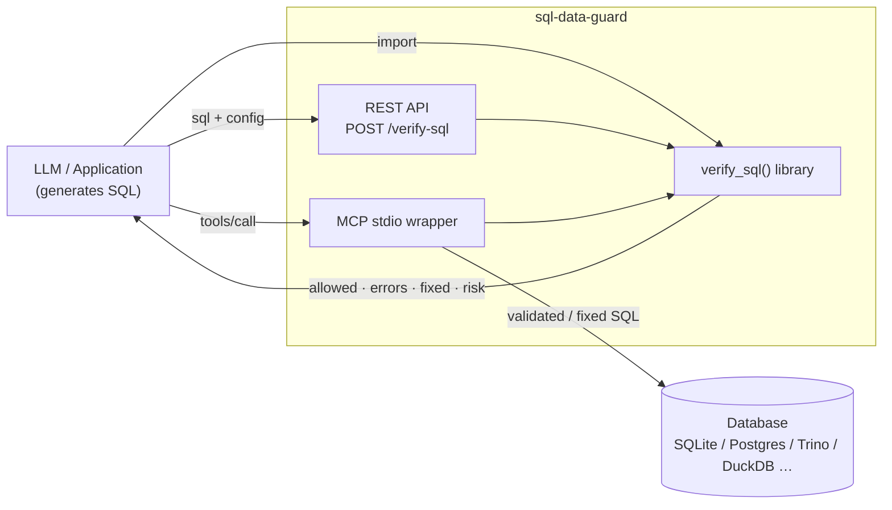
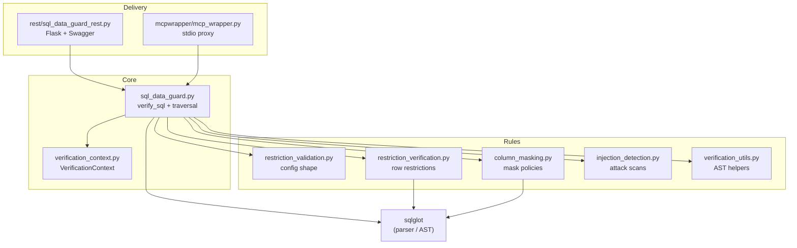
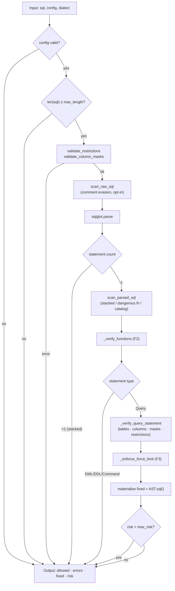
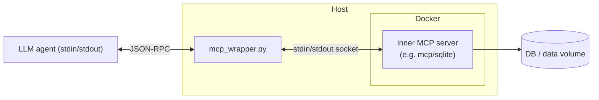

# 02 · High-Level Design (HLD)

> The "30,000-foot" view: what the system is for, the major components, how data flows, and the deployment surfaces. For implementation detail see [03-LLD](03-LLD.md).

See also: [00-INDEX](00-INDEX.md) · [01-CODE_EXPLANATION](01-CODE_EXPLANATION.md) · [04-ARCHITECTURE](04-ARCHITECTURE.md)

---

## 1. Executive summary

**Purpose.** `sql-data-guard` is a *defence-in-depth* layer that sits between an SQL-generating client (often an LLM) and a database. It inspects each query against a declarative restriction configuration and either **allows**, **rewrites** (auto-fix), or **blocks** it.

**Business objective.** Prevent unauthorised data access and SQL-injection-style data exposure for dynamic, LLM-generated queries that *cannot* be expressed as prepared statements. It supports fine-grained, column-level and row-level (multi-tenant) security that the database permission model often cannot express — and helps meet GDPR/CCPA obligations.

**Main workflows.**

1. **Verify** — given `(sql, config)`, decide allowed/blocked and compute a risk score.
2. **Auto-fix** — rewrite a non-compliant-but-fixable query to a compliant one.
3. **Detect attacks** — flag stacked queries, dangerous functions, system-catalog probing, comment evasion.
4. **Proxy** — (MCP wrapper) transparently validate SQL flowing from an agent to a DB server.

**Key responsibilities.**

| Responsibility | Owner module |
|----------------|--------------|
| Orchestration & query traversal | `sql_data_guard.py` |
| Config validation (fail-fast) | `restriction_validation.py`, `column_masking.py` |
| Row-level restriction enforcement | `restriction_verification.py` |
| Column allow/deny & masking | `sql_data_guard.py`, `column_masking.py` |
| Attack detection | `injection_detection.py` |
| Result accumulation & risk | `verification_context.py` |
| Delivery surfaces | `rest/`, `mcpwrapper/` |

---

## 2. System context

> `sql-data-guard` does **not** execute SQL itself (except in tests). It is a validator/rewriter. The caller remains responsible for executing the (possibly fixed) query.

---

## 3. Component overview

---

## 4. End-to-end data flow

---

## 5. Configuration model (high level)

A config is a JSON/dict document. Top-level keys:

| Key | Required | Purpose | Feature |
|-----|----------|---------|---------|
| `tables` | ✅ | Allow-listed tables, each with `columns`, optional `restrictions`, `denied_columns`, `column_masks` | core |
| `max_length` | optional | Max raw SQL length (default 10000) | core |
| `max_risk` | optional | Hard-block threshold on the risk score | F5 |
| `force_limit` | optional | Mandatory row cap on the outer query | F3 |
| `allowed_functions` / `blocked_functions` | optional | Function allow/deny list | F2 |
| `detect_comments` / `detect_injection.comments` | optional | Opt-in comment-evasion scan | F1 |

Per-table keys: `table_name`, `columns`, `restrictions[]`, `denied_columns[]`, `column_masks[]`.

---

## 6. Deployment surfaces

| Surface | How to run | Best for |
|---------|-----------|----------|
| **Library** | `pip install sql-data-guard`; `from sql_data_guard import verify_sql` | In-process integration in a Python app |
| **REST** | `docker run -p 5000:5000 ghcr.io/thalesgroup/sql-data-guard` | Language-agnostic microservice; Swagger at `/apidocs` |
| **MCP wrapper** | Run `mcp_wrapper.py` with a `/conf/config.json`; it spawns the inner MCP server container | Transparent guard for MCP-based LLM agents |

---

## 7. Quality attributes

| Attribute | How the design addresses it |
|-----------|------------------------------|
| **Security** | Default-deny tables/columns; read-only posture (DML/DDL blocked); injection neutralisation; safe literal escaping; optional API key. |
| **Backward compatibility** | All new policies (F2/F3/F5/F10/masking, comment detection) are opt-in; benign queries are unaffected. |
| **Portability** | sqlglot abstracts dialects (sqlite, postgres, mysql, trino, duckdb tested). |
| **Determinism** | Errors are an ordered, de-duplicated list. |
| **Testability** | Pure function core (`verify_sql`) with no I/O; large pytest suite incl. real DB execution. |
| **Performance** | Single parse pass; bounded input length; in-place AST mutation avoids re-parsing. |
