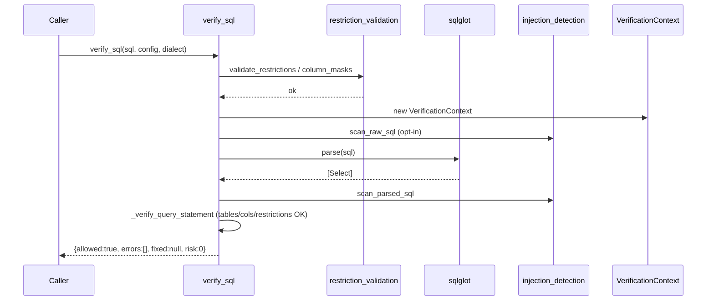
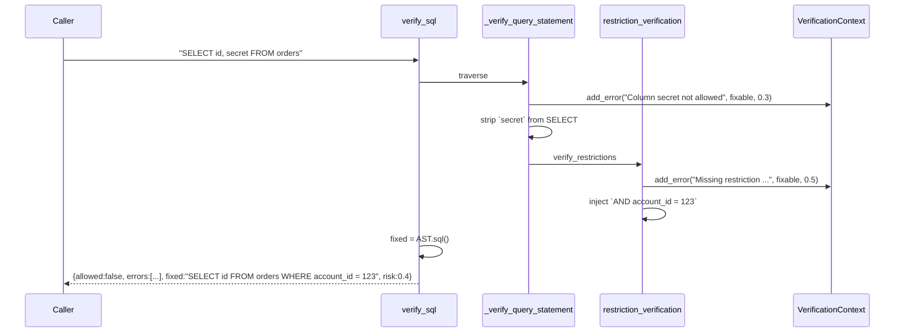
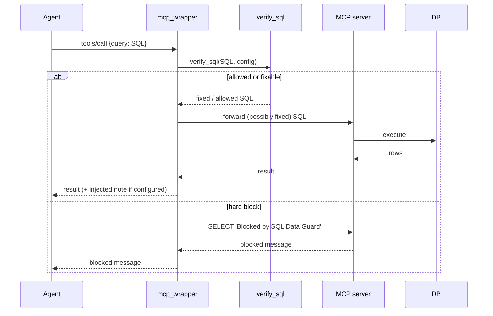

# 03 · Low-Level Design (LLD)

> Implementation-level detail: classes, signatures, algorithms, and sequence diagrams. Pairs with [01-CODE_EXPLANATION](01-CODE_EXPLANATION.md) (prose) and [02-HLD](02-HLD.md) (overview).

---

## 1. Public API contract

```python
def verify_sql(sql: str, config: dict, dialect: str = None) -> dict: ...
```

| Param | Type | Notes |
|-------|------|-------|
| `sql` | `str` | Raw query; length-capped by `config["max_length"]` (default 10000). |
| `config` | `dict` | Must contain `"tables"`; otherwise hard-blocked. |
| `dialect` | `str?` | Passed through to sqlglot (`"sqlite"`, `"postgres"`, `"mysql"`, `"trino"`, `"duckdb"`, …). |

**Return:** `{"allowed": bool, "errors": List[str], "fixed": Optional[str], "risk": float}`.

---

## 2. Class & function inventory

### 2.1 `VerificationContext` (`verification_context.py`)

```python
class VerificationContext:
    def __init__(self, config: dict, dialect: str)
    @property can_fix: bool
    @property errors: List[str]
    @property fixed: Optional[str]      # settable
    @property config: dict
    @property dynamic_tables: Dict[str, Set[str]]
    @property dynamic_columns: Set[str]
    @property dialect: str
    @property column_masks: Dict[str, Dict[str, dict]]
    @property risk: float               # mean of _risk, 0 if empty
    def add_error(self, error: str, can_fix: bool, risk: float) -> None
```

**`add_error` algorithm:**
```
if error not in _errors: _errors.append(error)   # ordered de-dup
if not can_fix:          _can_fix = False         # latch
_risk.append(risk)                                # always recorded
```

### 2.2 Orchestrator functions (`sql_data_guard.py`)

| Function | Signature | Mutates AST? | Emits |
|----------|-----------|--------------|-------|
| `verify_sql` | `(sql, config, dialect) -> dict` | drives | final dict |
| `_verify_functions` | `(parsed, context)` | no | hard block on disallowed fn |
| `_enforce_force_limit` | `(parsed, context)` | yes (sets LIMIT) | fixable |
| `_verify_query_statement` | `(query, context)` | yes (recurses) | various |
| `_verify_from_tables` | `(context, query) -> List[Table]` | no | hard block on bad table |
| `_verify_select_clause` | `(context, clause, from_tables)` | yes (strips cols) | fixable / hard |
| `_verify_select_clause_element` | `(from_tables, context, e) -> bool` | yes | — |
| `_expand_star` | `(e, from_tables, context, table_filter="")` | yes (expands `*`) | fixable |
| `_verify_col` | `(col, from_tables, context) -> bool` | no | fixable on deny/disallow |
| `_apply_column_mask` | `(col, from_tables, context)` | yes (rewrite) | fixable |
| `_verify_where_clause` | `(context, query, from_tables)` | yes | — |
| `_verify_static_expression` | `(query, context) -> bool` | yes (→ FALSE) | fixable |
| `_get_from_clause_tables` | `(query, context) -> List[Table]` | yes (verifies subqueries) | — |
| `_add_table_alias` / `_register_dynamic_columns` | `(exp, context)` | no | populates dynamic maps |

### 2.3 Restriction modules

```python
# restriction_validation.py
def validate_restrictions(config: dict) -> None            # raises UnsupportedRestrictionError | ValueError
SUPPORTED_OPERATIONS = {"=", ">", "<", ">=", "<=", "BETWEEN", "IN"}

# restriction_verification.py
def verify_restrictions(select, context, from_tables) -> None
def _verify_restriction(restriction, from_table, exp) -> bool
def _compare_values(query_value, restriction_value, operation) -> bool
def _create_new_condition(context, restriction, table_prefix) -> Expression
def _format_value(value) -> str                            # safe SQL literal
```

### 2.4 Masking (`column_masking.py`)

```python
SUPPORTED_MASK_POLICIES = {"redact", "hash", "partial"}
def validate_column_masks(config: dict) -> None
def build_mask_lookup(config: dict) -> Dict[str, Dict[str, dict]]
def build_mask_expression(mask: dict, column: Column, dialect: Optional[str]) -> Expression
```

### 2.5 Injection detection (`injection_detection.py`)

```python
def scan_raw_sql(sql: str, context) -> None                 # opt-in
def scan_parsed_sql(parsed, context) -> None                # always-on
def comment_detection_enabled(config: dict) -> bool
def is_stacked_statement(parsed) -> bool
def function_name(func: Func) -> str
_DANGEROUS_FUNCTIONS: frozenset
_SYSTEM_CATALOGS: frozenset
```

---

## 3. Core algorithms

### 3.1 Restriction satisfaction (`_verify_restriction`)

```text
if exp is NOT            -> False  (negation can't satisfy a positive restriction)
if exp is Paren          -> recurse into exp.this
if exp.this not Column or name != restriction.column        -> False
if table-qualified and table doesn't match from_table       -> False
values = restriction values (as strings)
match exp:
  IN       -> every query member ∈ values
  EQ       -> query value ∈ values
  BETWEEN  -> restriction.low ≤ query.low AND query.high ≤ restriction.high
  LT/LE/GT/GE -> operator matches restriction.operation
              AND _compare_values(query_value, values[0], op)
else -> False
```

### 3.2 Numeric-aware comparison (`_compare_values`, fix S2)

```text
try: left, right = float(query_value), float(restriction_value)
except: left, right = query_value, restriction_value   # lexicographic fallback
apply <, <=, >, >= accordingly
```
Prevents `"9" < "18"` evaluating false due to string ordering.

### 3.3 Static-expression neutralisation (`OR 1=1`)

```text
for each OR-branch of a WHERE AND-term:
    if branch has no Column node:
        add_error("Static expression is not allowed", fixable, 0.8)
        if branch's (un-parenthesised) parent is an OR:
            replace branch with Boolean(False)
simplify(where_clause)   # collapses `... OR FALSE` to `...`
```

### 3.4 Force-limit (F3)

```text
if force_limit not positive int (or is bool): return
limit = outer query LIMIT
if limit exists and current ≤ force_limit: return        # leave alone
set LIMIT = force_limit
add_error("Row limit enforced: ...", fixable, 0.3)
```

---

## 4. Sequence diagrams

### 4.1 Happy path — fully compliant query



### 4.2 Auto-fix path — disallowed column + missing restriction



### 4.3 Hard block — stacked query

```mermaid
sequenceDiagram
    participant Caller
    participant verify_sql
    participant sqlglot
    participant Ctx as VerificationContext

    Caller->>verify_sql: "SELECT id FROM orders; DROP TABLE orders"
    verify_sql->>sqlglot: parse(sql)
    sqlglot-->>verify_sql: [Select, Drop]  (len > 1)
    verify_sql->>Ctx: add_error("Stacked query detected", can_fix=false, 0.9)
    verify_sql-->>Caller: {allowed:false, fixed:null, risk:0.9}
```

### 4.4 MCP proxy interception



---

## 5. State: the dynamic-source maps

`VerificationContext` carries two maps that make sub-queries / CTEs safe:

| Map | Populated by | Used by |
|-----|--------------|---------|
| `dynamic_tables: {alias -> {columns}}` | `_add_table_alias` (TableAlias columns or `named_selects`) | `_verify_col` to allow qualified refs to a sub-source's real columns |
| `dynamic_columns: {column}` | `_register_dynamic_columns` (un-aliased sources) | `_verify_col` to allow un-prefixed refs |

**Ordering rule (S3):** a sub-query must be *verified and SELECT-`*` expanded* **before** its exposed columns are recorded, so the alias maps to real allowed columns, not `*`.

---

## 6. Error taxonomy & risk weights

| Finding | Fixable? | Risk |
|---------|----------|------|
| Invalid config / over max_length | no | 1.0 |
| Table not allowed | no | 1.0 |
| Stacked query / dangerous fn | no | 0.9 |
| DML/DDL/Command | no | 0.9 |
| Parse error | no | 0.9 |
| Static (always-true) expression | yes | 0.8 |
| Comment evasion / system catalog | no | 0.8 |
| Could not find query statement | no | 0.7 |
| Missing restriction | yes | 0.5 |
| No legal SELECT elements | no | 0.5 |
| Disallowed / denied column | yes | 0.3 |
| Force-limit enforced | yes | 0.3 |
| Column masked | yes | 0.2 |
| SELECT * expansion | yes | 0.1 |

> `risk` = mean of the weights recorded for *all* findings on the query.

---

## 7. Error-handling strategy

| Layer | Strategy |
|-------|----------|
| Config validation | Raises `UnsupportedRestrictionError` / `ValueError`, caught in `verify_sql` and converted to a hard-block dict. |
| Parsing | `sqlglot.errors.ParseError` caught; logged; recorded as a finding (does not raise to caller). |
| Value coercion | `_compare_values` / limit parsing wrap `ValueError`/`TypeError`/`AttributeError` with safe fallbacks. |
| REST | Returns `400` for non-JSON / missing `sql`/`config`; `401` for bad API key. |
| MCP | `KeyboardInterrupt`/`EOFError` caught to stop the inner container cleanly. |
