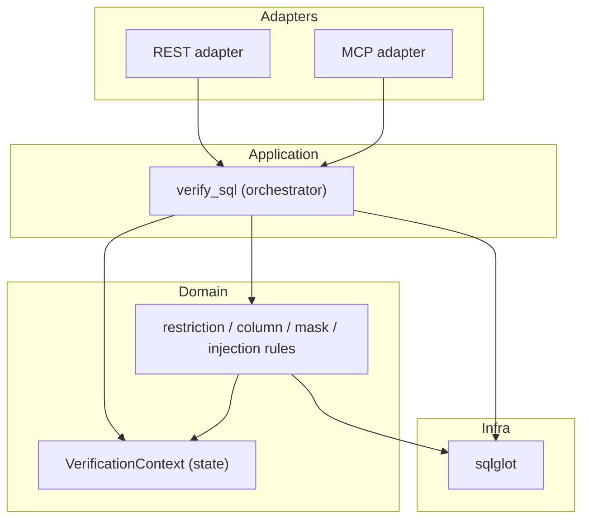
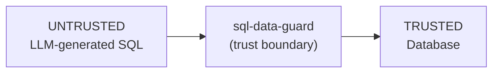

# 04 · Architecture, Security, Performance & Refactoring

> Architectural decisions, design patterns, the security model, performance considerations, and a prioritised refactoring/technical-debt register.

See also: [02-HLD](02-HLD.md) · [03-LLD](03-LLD.md) · [05-CODING_GUIDELINES](05-CODING_GUIDELINES.md)

---

## 1. Architectural style

`sql-data-guard` is a **layered, pipeline-oriented validator** built around a single pure function (`verify_sql`) with thin delivery adapters (REST, MCP). The processing core is an **AST-rewriting pipeline**: parse → scan → traverse/mutate → serialise.



---

## 2. Design patterns in use

| Pattern | Where | Benefit / drawback |
|---------|-------|--------------------|
| **Facade** | `__init__.py` exposes only `verify_sql` | Stable public surface; internals free to change. |
| **Pipeline / Chain of stages** | `verify_sql` orchestration | Clear, ordered stages; easy to insert new checks. Drawback: the function is long. |
| **Strategy** | Mask policies (`redact`/`hash`/`partial`); restriction operators | New policies/operators added without touching callers. |
| **Visitor-ish traversal** | `_verify_query_statement` recursion over sqlglot nodes | Handles arbitrary nesting (CTEs, sub-queries, set ops). |
| **Accumulator / Context object** | `VerificationContext` | Threads mutable result state without global state; testable. |
| **Adapter** | `rest/` and `mcpwrapper/` wrap the core | Multiple delivery surfaces share one engine. |
| **Fail-fast guard clauses** | Config + length gates at the top of `verify_sql` | Cheap rejection before expensive parsing. |

---

## 3. Security model

### 3.1 Trust boundaries



The guard treats *all* incoming SQL as hostile. The configuration is the *trusted policy*.

### 3.2 Controls (mapped to attack classes)

| Attack class | Control | Module |
|--------------|---------|--------|
| Column over-exposure | Column allow-list + deny-list (F10) + masking | `sql_data_guard`, `column_masking` |
| Row over-exposure / multi-tenant leak | Mandatory restrictions injected into WHERE | `restriction_verification` |
| Always-true / boolean injection (`OR 1=1`) | Static-expression detection → `FALSE` + simplify | `sql_data_guard` |
| Stacked / multi-statement (`; DROP`) | Statement-count + Block-node detection | `verify_sql`, `injection_detection` |
| Dangerous functions (`LOAD_FILE`, `xp_cmdshell`, `SLEEP`) | Always-on deny-list + config deny/allow (F2) | `injection_detection`, `sql_data_guard` |
| System-catalog exfiltration | Catalog table deny-list | `injection_detection` |
| Comment evasion (`-- payload`) | Pre-parse raw scan (opt-in) | `injection_detection` |
| UNION/EXCEPT/INTERSECT smuggling | Each set-op arm verified independently (S4) | `sql_data_guard` |
| Sub-query column smuggling | Dynamic columns resolved, not blanket-trusted (S3) | `sql_data_guard` |
| Injection via the *fix itself* | Safe literal escaping (S1) | `restriction_verification` |
| Oversized payload DoS | `max_length` gate | `verify_sql` |
| Excessive data return | `force_limit` row cap (F3) | `sql_data_guard` |
| Risk accumulation | `max_risk` hard-block threshold (F5) | `verify_sql` |
| Unauthorised API access | Optional `X-API-Key` (S6) | `rest` |

### 3.3 Posture

- **Read-only by default:** `Delete`/`Insert`/`Update`/`Create`/`Command` are hard-blocked.
- **Default-deny:** unknown tables/columns are rejected/stripped.
- **Defence in depth:** complements, does not replace, DB permissions.

### 3.4 Residual risks (from F1 doc + code review)

- **Comment detection is coarse** — flags `--`/`/* */` anywhere when enabled, including inside string literals (potential false positives). A precise version would strip string literals first.
- **Risk is an average**, diluting a single high-risk finding among many low-risk ones (see §6).
- **MCP wrapper non-fixable fallback** builds a `UNION ALL SELECT '<error>'` string from error messages; error text is developer-controlled, but the pattern is worth auditing for injection if messages ever incorporate user input.

---

## 4. Performance considerations

### 4.1 Python / engine

| Aspect | Observation | Note |
|--------|-------------|------|
| Parse cost | Single `sqlglot.parse` per call | Dominant cost; bounded by `max_length`. |
| Traversal | One recursive pass; `find_all` used several times per query | For very large queries, repeated `find_all` could be consolidated. |
| In-place mutation | Avoids re-parsing to produce `fixed` | Efficient — `fixed = AST.sql()` is one serialisation. |
| Allocation | New `VerificationContext` per call | Cheap; stateless across calls (thread-safe). |

### 4.2 Database

`sql-data-guard` does not run SQL in production, but its **rewrites affect DB performance**:

- Injected restrictions add `WHERE` predicates — generally *improve* selectivity (encourage index use).
- `SELECT *` expansion lists explicit columns — neutral-to-positive (avoids reading unneeded columns only if projection is pushed down).
- Masking wraps columns in `MD5`/`CONCAT`/`SUBSTRING` — these are **non-sargable**; masked columns won't use indexes (acceptable since they're output transforms, not filters).
- `force_limit` adds `LIMIT` — caps result transfer and can enable early termination.

### 4.3 API

- Flask dev server (`app.run`) is used directly — fine for dev; **production should front it with a WSGI server** (gunicorn/uWSGI) behind TLS.

---

## 5. Concurrency & thread-safety

- The core is **stateless between calls**; all per-query state lives in a fresh `VerificationContext`. `verify_sql` is therefore safe to call concurrently.
- The MCP wrapper uses a daemon thread to stream the inner container's stdout and mutates a module-level `errors` dict keyed by request id — **the only shared mutable state**; under high concurrency this dict access is not explicitly locked (low risk for stdio single-agent use, but noted).

---

## 6. Technical debt & risk register

### High

| ID | Item | Rationale | Suggested fix |
|----|------|-----------|---------------|
| H1 | **Risk = mean** dilutes severity | Many low-risk fixes can mask one 0.9 finding; weakens `max_risk` policy | Switch to `max(weights)` or a weighted scheme; keep mean as secondary metric. |
| H2 | **Coarse comment scan** | False positives on comments inside string literals | Strip string literals before regex; or tokenise. |
| H3 | **`verify_sql` length/complexity** | The orchestrator function does config-gate + parse + scan + dispatch (cyclomatic > target) | Extract `_parse_statements`, `_dispatch_statement`, `_finalise_result`. |

### Medium

| ID | Item | Suggested fix |
|----|------|---------------|
| M1 | `_verify_col` boolean chain is large/hard to read | Extract named predicates (`_is_dynamic_match`, `_is_config_column`). |
| M2 | Repeated `for config_t in context.config["tables"]` scans | Precompute `{table_name: config_table}` once in the context. |
| M3 | REST runs Flask dev server | Document/ship a gunicorn entrypoint for production. |
| M4 | MCP shared `errors` dict unlocked | Guard with a lock or use per-request correlation that doesn't share state. |

### Low

| ID | Item | Suggested fix |
|----|------|---------------|
| L1 | Magic literals (`"sub_select"`, mask defaults) | Promote to named constants. |
| L2 | `_format_value` numeric branch returns `str(value)` unquoted | Fine for numerics; document the invariant. |
| L3 | Comment patterns recompiled at import | Acceptable; already module-level constants. |

---

## 7. Selected refactoring opportunities (with examples)

### 7.1 Risk aggregation (H1)

**Current**
```python
@property
def risk(self) -> float:
    return sum(self._risk) / len(self._risk) if self._risk else 0
```

**Proposed** (severity-preserving)
```python
@property
def risk(self) -> float:
    return max(self._risk) if self._risk else 0.0
```
*Benefit:* a single dangerous-function finding (0.9) is no longer diluted by several 0.1 SELECT-* findings, so `max_risk` thresholds behave intuitively. *Impact:* would change some existing risk assertions — coordinate with tests (documented change, not silent).

### 7.2 Table lookup index (M2)

**Current:** nested loops over `config["tables"]` in `_verify_from_tables`, `_verify_col`, `_expand_star`, `verify_restrictions`.

**Proposed:** build `context._tables_by_name = {t["table_name"]: t for t in config["tables"]}` once; O(1) lookups thereafter.

### 7.3 Decompose `verify_sql` (H3)

Split into:
```python
def verify_sql(sql, config, dialect=None):
    guard = _pre_checks(sql, config)          # config + length gates
    if guard: return guard
    ctx = VerificationContext(config, dialect)
    parsed = _scan_and_parse(sql, ctx, dialect)
    _dispatch_statement(parsed, ctx, dialect)
    return _finalise(parsed, ctx, config, dialect)
```
*Benefit:* each helper is independently testable and under the complexity limit.

---

## 8. Architecture decision summary

| Decision | Why | Trade-off |
|----------|-----|-----------|
| AST-based (sqlglot) over regex | Robust to whitespace/case/dialect tricks; enables safe rewriting | Adds a parse dependency; limited by sqlglot's grammar coverage. |
| In-place AST mutation + re-serialise | Single-pass auto-fix | Mutating shared nodes requires careful ordering (CTEs registered twice). |
| Opt-in for all new policies | Backward compatibility (280+ tests stayed green) | Secure defaults rely on the operator enabling features. |
| Read-only posture | LLM queries should never write | Write use-cases need explicit future support. |
| Mean risk (current) | Simple | Dilution problem (H1). |
